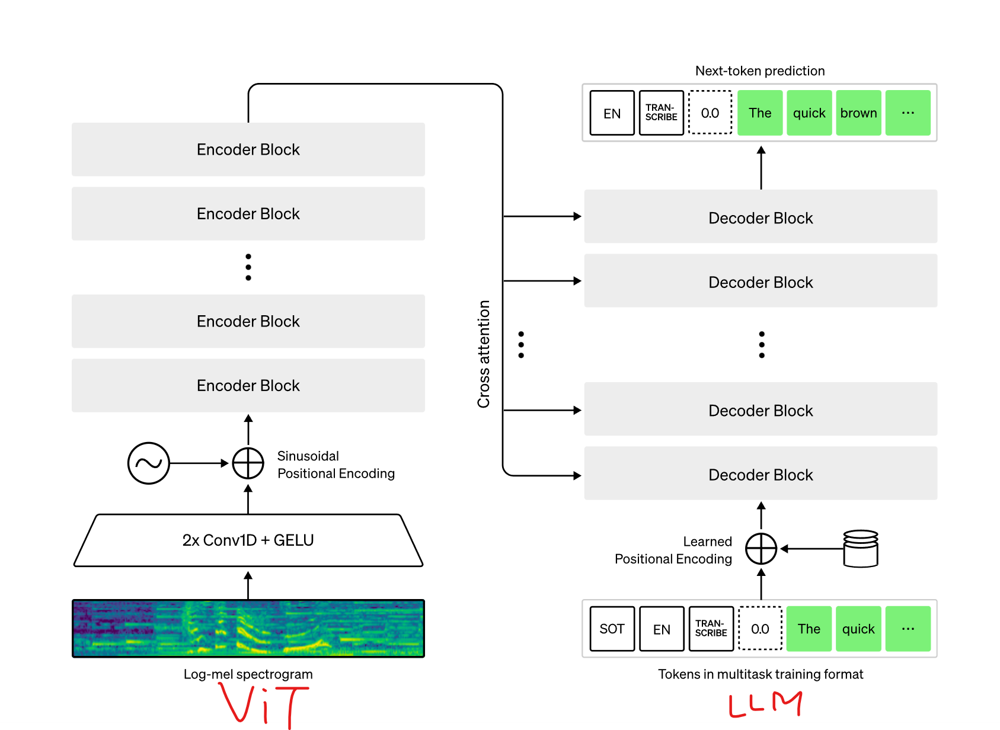

# 1교시 — 개발환경 준비 + 오디오 스모크 테스트

> **이 교시가 끝나면** 브라우저에서 내 목소리가 그대로 되돌아오는(echo) 음성 왕복을 확인하고, `uv run pytest`가 초록불(통과)로 뜹니다. 즉, **앞으로 12교시 동안 쓸 작업대가 완성**됩니다.

> 아키텍처 노트참고

> model : gpt-realtime  



---

## 0. 이 교시에 만드는 것 (한눈에)

```
[내 목소리] → 브라우저(마이크) → FastRTC → 파이썬 함수(echo) → 브라우저(스피커) → [내 목소리 그대로]
```
```my
FastRTC : WebRTC 추상화  huggingface gradio team 구현  
          파이썬(Python) 개발자가 복잡한 네트워크 프로그래밍 없이도 실시간 오디오 및 비디오 애플리케이션을 쉽게 구축할 수 있게 해주는 라이브러리입니다. 주로 실시간 AI 음성/영상 비서나 챗봇을 개발하려는 엔지니어들을 위해 설계
```
아직 OpenAI(AI 두뇌)는 붙이지 않습니다. 이 교시의 목표는 단 하나, **"오디오가 끊김 없이 왕복하는가"** 라는 가장 잘 깨지는 부분을 먼저 검증하는 것입니다. 이 배관만 튼튼하면 나머지 교시(도메인·AI·도구)를 그 위에 안심하고 쌓을 수 있습니다.

> 💡 **왜 echo(메아리)부터 시작하나?** 보이스 에이전트에서 가장 자주 막히는 곳은 똑똑한 AI 부분이 **아닙니다.** 오히려 **마이크 권한 · WebRTC 연결 · 오디오 형식(코덱)** 같은 "배관" 쪽입니다. 그래서 AI를 붙이기 전에, 내 목소리가 그대로 되돌아오는지(echo)부터 확인해 배관이 새지 않는 걸 보장합니다. 문제가 생겨도 "AI 탓인지 배관 탓인지" 헷갈릴 일이 없어집니다.

---

## 🧭 잠깐, 배경지식

이 과정에서 계속 나올 세 가지 개념을 짚고 갑니다. 지금 다 외울 필요는 없고, "대충 이런 거구나" 정도면 충분합니다.

**① 오디오는 결국 '숫자의 나열'입니다.** 마이크는 공기의 떨림(소리)을 아주 짧은 간격으로 측정해 숫자로 바꿉니다. 1초에 몇 번 재는지를 **샘플레이트(sample rate)** 라 하고, 단위는 Hz입니다. 예를 들어 24000Hz(=24kHz)는 1초에 24,000번 소리 크기를 측정한다는 뜻입니다. 이렇게 만든 가공 없는 원본 숫자열을 **PCM(Pulse-Code Modulation)**이라 부릅니다. 우리가 다루는 오디오는 대부분 "24kHz · 16비트 정수 PCM" 형식입니다. (5·6교시에서 실제로 이 숫자 배열을 주고받습니다.)

**② WebRTC는 '브라우저용 실시간 통화 기술'입니다.** 원래 화상통화(줌·구글미트 등)를 위해 만들어진 표준으로, 브라우저와 서버가 **오디오를 지연 없이 주고받게** 해줍니다. 직접 구현하기엔 복잡하지만(마이크 접근·연결 협상·네트워크 통과), 다행히 **FastRTC**가 이 복잡한 부분을 대신 처리해 줍니다. 우리는 "받은 오디오로 무엇을 할지"만 파이썬 함수로 쓰면 됩니다.  
 직접구현 시 P2P라 handshake 규칙없어서 작성부터 복잡 - 구현된 FastRTC 사용!

**③ '서버'와 '클라이언트'.** 브라우저(내 화면)가 **클라이언트**, 파이썬으로 띄우는 프로그램이 **서버**입니다. 이 교시에선 둘 다 내 PC 안에서 돌아갑니다(`127.0.0.1`은 "내 컴퓨터 자신"을 가리키는 주소입니다).

> 💡 WebSocket(4·5교시에서 등장)이라는 또 다른 통신 기술도 나오는데, 그건 해당 교시에서 다시 쉽게 설명합니다. 지금은 "WebRTC = 브라우저↔서버 실시간 오디오"만 기억하면 됩니다.

---

## 준비물 체크 (시작 전 1분)

- [ ] Windows 11
- [ ] 인터넷 연결
- [ ] 마이크 + 스피커(또는 이어폰) — 노트북 내장도 OK
- [ ] **Chrome** 또는 **Edge** 브라우저 (WebRTC가 가장 안정적)
- [ ] OpenAI 계정 (키 발급용 — 5교시부터 실제 사용)

---

## STEP 1 — PowerShell 7 설치하고 기본 터미널로 지정

Windows에 원래 있는 "Windows PowerShell"(5.1)은 오래된 버전이라 **한글이 깨지기 쉽습니다.** 새 버전인 PowerShell 7(명령어 이름은 `pwsh`)을 깝니다.

1) **시작 메뉴 → "터미널"** 을 열고 다음을 붙여넣어 실행합니다.

```powershell
winget install --id Microsoft.PowerShell --source winget
```

2) 설치가 끝나면 **터미널을 완전히 닫았다가 다시 엽니다.**

3) 터미널 상단 탭의 **아래 화살표(˅) → "기본 프로필 선택" → "PowerShell"** 을 고릅니다.
   (목록에 `PowerShell`과 `Windows PowerShell`는 5, 둘 다 보이면 **`Windows`가 안 붙은** `PowerShell`이 7입니다.)

4) 버전을 확인합니다.

```powershell
$PSVersionTable.PSVersion
```

**예상 출력** (숫자는 7 이상이면 됩니다):

```text
Major  Minor  Patch  PreReleaseLabel BuildLabel
-----  -----  -----  --------------- ----------
7      5      3
```

> ⚠️ **`winget`을 모른다고 나오면** → Microsoft Store에서 "App Installer"를 설치하거나 Windows 업데이트 후 다시 시도하세요.

---

## STEP 2 — 한글이 안 깨지게 UTF-8 고정하기

보이스 에이전트는 한글 전사(받아쓰기)와 로그를 많이 출력합니다. 터미널을 UTF-8로 고정해 두면 깨짐(���)을 예방합니다.

1) 내 프로파일 파일을 만들고 UTF-8 설정 두 줄을 추가합니다. **아래 블록을 통째로** 붙여넣으세요.

```powershell
if (!(Test-Path $PROFILE)) { New-Item -ItemType File -Force -Path $PROFILE | Out-Null }
Add-Content $PROFILE "`n[Console]::OutputEncoding = [System.Text.Encoding]::UTF8"
Add-Content $PROFILE "`n`$OutputEncoding = [System.Text.Encoding]::UTF8"
```

2) 터미널을 닫았다 다시 열고 한글 출력을 확인합니다.

```powershell
"안녕하세요 보이스 에이전트"
```

**예상 출력**:

```text
안녕하세요 보이스 에이전트
```

> 💡 **`$PROFILE`이 뭐죠?** 터미널이 켜질 때마다 자동 실행되는 내 개인 설정 파일입니다. 여기 한 번 적어두면 매번 설정할 필요가 없습니다.

---

## STEP 3 — uv 설치 (파이썬 버전·패키지 관리자)

`uv`는 파이썬 설치, 가상환경, 패키지 설치를 **한 도구로** 처리하는 빠른 관리자입니다.

```powershell
powershell -ExecutionPolicy ByPass -c "irm https://astral.sh/uv/install.ps1 | iex"
```

설치 후 **터미널을 다시 열고** 확인합니다.

```powershell
uv --version
```

**예상 출력**:

```text
uv 0.11.25 (...)
```

이제 `uv`로 **파이썬 3.12를 설치**합니다. (시스템에 다른 파이썬이 깔려 있어도, 이 과정은 uv가 관리하는 3.12를 사용합니다.)

```powershell
uv python install 3.12
```

**예상 출력**:

```text
Installed Python 3.12.x in ...
```

설치된 파이썬 목록을 **확인**합니다.

```powershell
uv python list
```

**예상 출력** (3.12 항목이 보이고, 설치 경로가 함께 표시됩니다):

```text
cpython-3.12.x-windows-x86_64-none    <설치 경로>
cpython-3.13.x-windows-x86_64-none    <download available>
...
```

> 💡 **`uv python list`는** uv가 인식하는 모든 파이썬을 보여줍니다. 경로가 함께 표시되면 **실제로 설치된 것**이고, `<download available>`로 표시되면 아직 안 깔린(받을 수 있는) 버전입니다. `3.12`가 설치된 것으로 보이면 다음 STEP의 `uv init --python 3.12`가 이 버전을 그대로 사용합니다.

> 💡 **`pip`이나 `venv`를 따로 안 써도 되나요?** 네. 이 과정에서는 `uv`가 파이썬 3.12까지 알아서 깔고 관리합니다. 우리는 **항상 `uv run`** 으로 실행할 거라 가상환경을 손으로 켤 일도 거의 없습니다.

---

## STEP 4 — 프로젝트 만들고 Clean Architecture 폴더 잡기

1) 프로젝트 폴더를 만들고 들어갑니다. (`Documents` 등 원하는 위치에서)

```powershell
mkdir voice-agent
cd voice-agent
```

2) `uv`로 파이썬 3.12 프로젝트를 초기화합니다. (STEP 3에서 설치한 3.12를 사용합니다)

```powershell
uv init --python 3.12
```

3) 우리 아키텍처의 4개 계층 폴더를 만듭니다. **안쪽(domain)일수록 순수하고, 바깥쪽(infra)일수록 외부와 연결**됩니다.

```powershell
New-Item -ItemType Directory -Force -Path `
  src/voice_agent/domain, `
  src/voice_agent/usecase, `
  src/voice_agent/adapter, `
  src/voice_agent/infra, `
  tests/domain | Out-Null
```

4) 파이썬이 각 폴더를 "패키지"로 인식하게 빈 `__init__.py`를 깝니다.

```powershell
New-Item -ItemType File -Force -Path `
  src/voice_agent/__init__.py, `
  src/voice_agent/domain/__init__.py, `
  src/voice_agent/usecase/__init__.py, `
  src/voice_agent/adapter/__init__.py, `
  src/voice_agent/infra/__init__.py | Out-Null
```

5) 완성된 구조를 확인합니다.

```powershell
tree src /F
```

**예상 출력** (대략):

```text
src
└─voice_agent
    ├─adapter
    │   __init__.py
    ├─domain
    │   __init__.py
    ├─infra
    │   __init__.py
    └─usecase
        __init__.py
```

> 💡 **줄 끝의 백틱(`` ` ``)은 뭐죠?** PowerShell에서 "명령어가 다음 줄로 이어짐"을 뜻합니다. bash의 `\`와 같은 역할입니다.

---

## STEP 5 — 필요한 패키지 설치

### 먼저: `uv add`가 하는 일

`uv add 패키지이름` 한 번이 세 가지를 동시에 처리합니다.

1. `pyproject.toml`의 의존성 목록에 패키지 이름을 **적습니다.**
2. 프로젝트 전용 가상환경(`.venv`)에 실제로 **설치합니다.**
3. 설치된 정확한 버전을 `uv.lock`에 **기록합니다.** → 다른 PC에서도 똑같은 버전이 깔립니다(재현성).

> 💡 그래서 옛날 `pip install`처럼 "지금 이 PC에만" 까는 게 아니라, **프로젝트에 묶어서** 관리됩니다. 협업과 재현에 강합니다.

### 실행에 필요한 패키지 설치

```powershell
uv add "fastrtc[vad,stt,tts]" fastapi uvicorn openai websockets python-dotenv
```

각 패키지를 **왜** 까는지입니다.

| 패키지 | 역할 | 처음 쓰는 교시 |
|---|---|---|
| **fastrtc** | 파이썬 함수를 WebRTC 실시간 오디오 스트림으로 바꾸는 핵심 라이브러리 (오디오 "배관" 담당) | 5교시 |
| ↳ `[vad,stt,tts]` | fastrtc의 **추가 기능 묶음**: 음성 감지(VAD) · 받아쓰기(STT) · 음성합성(TTS) | 5·6교시 |
| **fastapi** | 웹 서버 프레임워크. FastRTC를 얹어 커스텀 UI·엔드포인트를 제공 | 7교시 |
| **uvicorn** | FastAPI 앱을 실제로 띄워 돌리는 실행 서버(ASGI 서버) | 7교시 |
| **openai** | OpenAI 공식 SDK. Realtime API(음성 "두뇌")를 호출 | 4교시 |
| **websockets** | Realtime API에 WebSocket으로 연결하는 저수준 통신 라이브러리 | 4·5교시 |
| **python-dotenv** | `.env` 파일에 적어둔 API 키 등을 코드에서 자동으로 읽어옴 | STEP 7 |

> 💡 **extras(`[vad,stt,tts]`)란?** 라이브러리의 "선택 기능 묶음"입니다. `fastrtc`만 깔면 기본 기능만 들어오고, `[vad,stt,tts]`를 붙이면 음성 관련 부가 기능까지 함께 설치됩니다.
>
> ⚠️ **따옴표는 필수**: PowerShell에서 대괄호 `[]`는 특수문자라, `"fastrtc[vad,stt,tts]"`처럼 따옴표로 감싸지 않으면 설치가 깨집니다.

### 개발할 때만 쓰는 도구 설치 (`--dev`)

```powershell
uv add --dev pytest ruff
```

| 패키지 | 역할 |
|---|---|
| **pytest** | 테스트를 찾아 실행하는 도구. 이 과정의 TDD 핵심 |
| **ruff** | 코드 스타일·간단한 오류를 빠르게 잡아주는 린터/포매터 |

> 💡 **`--dev`는 왜 붙이나요?** 테스트·검사 도구는 **개발할 때만** 필요하고, 실제 배포되는 앱에는 들어갈 필요가 없습니다. `--dev`로 넣으면 "개발 전용"으로 분리 기록되어, 나중에 배포용 의존성을 깔끔하게 유지할 수 있습니다.

### 설치 확인

```powershell
uv run python -c "import fastrtc, fastapi, openai; print('설치 OK')"
```

**예상 출력**:

```text
설치 OK
```

---

## STEP 6 — 프로젝트를 "설치 가능한 패키지"로 만들고 테스트 설정하기

우리 코드는 `src/voice_agent/`에 있습니다. 이걸 어디서든 `import voice_agent` 로 부를 수 있게, 프로젝트를 **설치 가능한 패키지로 선언**하고 설치합니다.

> ⚠️ 이 설정을 안 하면 `uv run python 스크립트.py`처럼 **일반 실행**에서 `ModuleNotFoundError: voice_agent`가 납니다. (pytest는 아래 `pythonpath` 덕에 돌아가지만, 4·5·7교시의 루트 스크립트·FastAPI 앱에서 걸립니다.)

1) `pyproject.toml`을 엽니다.

```powershell
notepad pyproject.toml
```

2) 아래 **세 블록을 파일 맨 끝에** 붙여넣고 저장합니다.

```toml
[build-system]
requires = ["hatchling"]
build-backend = "hatchling.build"

[tool.hatch.build.targets.wheel]
packages = ["src/voice_agent"]

[tool.pytest.ini_options]
pythonpath = ["src"]
testpaths = ["tests"]
```

각 블록의 뜻입니다.

- **`[build-system]`** — 이 프로젝트를 hatchling으로 빌드하는 **설치 가능한 패키지**라고 선언합니다. 이게 있어야 `voice_agent`가 진짜로 설치됩니다.
- **`[tool.hatch.build.targets.wheel]` / `packages = ["src/voice_agent"]`** — 패키지 코드가 `src/voice_agent`에 있다고 알려 줍니다. 프로젝트 이름(`voice-agent`, 하이픈)과 폴더 이름(`voice_agent`, 밑줄)이 달라서 **명시가 필요**합니다.
- **`[tool.pytest.ini_options]`** — pytest 설정 구역입니다. `pythonpath = ["src"]`는 테스트가 `src`를 찾게 하는 안전망이고(패키지 설치와 함께 이중으로 안전), `testpaths = ["tests"]`는 테스트를 `tests` 폴더에서만 찾게 해 `uv run pytest`만 쳐도 되게 합니다.

3) 선언한 대로 패키지를 환경에 설치(동기화)합니다.

```powershell
uv sync
```

> 💡 **`uv sync`가 하는 일**: `pyproject.toml`을 읽어, 의존성과 함께 **우리 패키지(`voice_agent`)를 editable(수정 즉시 반영) 모드로 `.venv`에 설치**합니다. 이후 일반 `python` 실행·`pytest`·FastAPI 앱 어디서든 `import voice_agent`가 동일하게 동작합니다. 새 파일을 `src/voice_agent/` 안에 추가해도 다시 sync할 필요가 없습니다.

설치가 됐는지 확인합니다. (지금은 폴더만 있고 코드는 2교시에 채우지만, 빈 패키지도 import는 됩니다.)

```powershell
uv run python -c "import voice_agent; print('패키지 설치 OK')"
```

**예상 출력**:

```text
패키지 설치 OK
```

4) 아주 작은 테스트를 하나 만듭니다.

```powershell
Set-Content tests/test_smoke.py "def test_pytest_works():`n    assert 1 + 1 == 2"
```

5) 테스트를 돌립니다.

```powershell
uv run pytest
```

**예상 출력** (초록색 `1 passed`):

```text
==== test session starts ====
collected 1 item
tests/test_smoke.py .                    [100%]
==== 1 passed in 0.01s ====
```

✅ 여기까지 오면 **패키지 + 테스트 환경 완성**입니다.

---

## STEP 7 — OpenAI 키를 `.env`에 저장하고 불러오기 (5교시부터 사용)

API 키를 코드에 직접 적으면 깃(GitHub)에 올라가 유출되기 쉽습니다. 그래서 키는 **`.env` 파일**에 따로 적어두고, 코드에서는 **python-dotenv**로 읽어옵니다.

1) [platform.openai.com](https://platform.openai.com) → **API keys** 에서 키를 발급합니다(`sk-...`).

2) 프로젝트 루트(`voice-agent` 폴더)에 `.env` 파일을 만듭니다.

```powershell
notepad .env
```

아래 한 줄을 적고 저장합니다. (따옴표 없이, `=` 양옆에 공백 없이)

```text
OPENAI_API_KEY=sk-여기에-내키
```

3) `.env`가 **깃에 올라가지 않도록** `.gitignore`에 추가합니다. (이미 있으면 중복 추가하지 않습니다.)

```powershell
if (-not (Select-String -Path .gitignore -Pattern '^\.env$' -Quiet)) { Add-Content .gitignore "`n.env" }
```

> ⚠️ **보안상 매우 중요한 단계입니다.** `.env`에는 과금되는 키가 들어 있으므로 절대 공개 저장소에 올리면 안 됩니다.

4) 키가 잘 읽히는지 확인하는 작은 스크립트를 만듭니다.

```powershell
notepad check_key.py
```

```python
import os                          # 환경변수(os.environ)에 접근하기 위한 표준 라이브러리
from dotenv import load_dotenv     # .env 파일을 읽어주는 도구 (python-dotenv)

load_dotenv()  # .env 파일을 찾아 읽고, 그 안의 값들을 환경변수로 올린다.
               # 이 한 줄 덕분에 아래에서 os.environ으로 키를 꺼낼 수 있다.

# 환경변수에서 OPENAI_API_KEY를 꺼낸다. 없으면 빈 문자열("")을 기본값으로.
key = os.environ.get("OPENAI_API_KEY", "")

# 키가 있으면 앞 7글자만 보여주고(전체 노출 방지), 없으면 실패 메시지를 출력.
# key[:7]은 문자열의 앞 7글자를 의미한다.
print("키 로딩됨:", key[:7] + "..." if key else "❌ 키를 찾지 못함")
```

5) 실행해 확인합니다. (**반드시 프로젝트 루트에서** 실행해야 `.env`를 찾습니다.)

```powershell
uv run python check_key.py
```

**예상 출력**:

```text
키 로딩됨: sk-proj...
```

> 💡 **`load_dotenv()`가 핵심입니다.** 이 한 줄이 `.env`의 내용을 읽어 `os.environ`(환경변수)에 올려줍니다. 그러면 코드 어디서든 `os.environ["OPENAI_API_KEY"]`로 키를 꺼낼 수 있습니다. 4교시부터 실제 앱이 시작될 때 이 패턴을 그대로 씁니다.

6) **비용 가드 (중요)**: OpenAI 대시보드 → **Settings → Limits** 에서 **월 사용 한도(hard limit)** 를 낮게(예: $10) 걸어두세요. Realtime은 음성이라 토큰 소모가 빠릅니다. 코드 레벨 절약(`reasoning.effort=low`)은 4교시에서 다룹니다.

> 💡 **echo 테스트(STEP 8)는 OpenAI를 쓰지 않으므로 키 없이도 됩니다.** 키는 5교시부터 실제로 과금됩니다.

---

## STEP 8 — 🎤 FastRTC 오디오 스모크 테스트

드디어 음성 왕복을 확인합니다.

1) 프로젝트 루트에 `smoke_echo.py` 파일을 만듭니다.

```powershell
notepad smoke_echo.py
```

아래 코드를 붙여넣고 저장합니다.

```python
# fastrtc에서 두 가지를 가져온다.
# - Stream: 오디오 스트림(마이크↔스피커 배관) 전체를 관리하는 핵심 객체
# - ReplyOnPause: "사용자가 말을 멈추면" 그때 내 함수를 불러주는 도우미
from fastrtc import Stream, ReplyOnPause


def echo(audio):
    """사용자가 말을 멈추면 호출된다. 받은 오디오를 그대로 되돌려준다(메아리).

    audio: (sample_rate, numpy배열) 형태의 튜플.
           - sample_rate: 초당 샘플 수 (예: 24000)
           - numpy배열: 실제 소리 크기를 담은 숫자들
    """
    # yield(내보내기)로 오디오를 돌려주면, FastRTC가 그걸 스피커로 재생한다.
    # return이 아니라 yield인 이유: 오디오는 '조각조각 흘려보내는' 스트림이라,
    #   여러 번 나눠 내보낼 수 있어야 하기 때문이다(제너레이터).
    yield audio


# Stream 객체를 만든다 = 오디오 배관 전체를 조립한다.
stream = Stream(
    handler=ReplyOnPause(echo),  # 말이 멈추면 echo 함수를 실행하도록 연결
    modality="audio",            # 다루는 미디어 종류: 오디오 (영상 아님)
    mode="send-receive",         # 받기(마이크)+보내기(스피커) 양방향
)

# 이 파일을 직접 실행했을 때만 아래를 수행한다(파이썬 관용구).
if __name__ == "__main__":
    # FastRTC가 제공하는 기본 테스트용 웹 UI를 띄운다.
    # 실행하면 브라우저로 접속할 주소(http://127.0.0.1:7860)가 출력된다.
    stream.ui.launch()
```

2) 실행합니다.

```powershell
uv run python smoke_echo.py
```

**예상 출력**:

```text
* Running on local URL:  http://127.0.0.1:7860
```

3) 출력된 주소(`http://127.0.0.1:7860`)를 **Chrome/Edge**로 엽니다.

4) 마이크 버튼을 누르고 **브라우저가 마이크 권한을 물으면 "허용"** 합니다.

5) "안녕하세요" 라고 말한 뒤 **잠깐 멈추면**, 잠시 후 내 목소리가 그대로 재생됩니다.

6) 확인했으면 터미널에서 **`Ctrl + C`** 로 종료합니다.

---

## ✅ 완성 체크포인트

아래가 모두 되면 1교시 성공입니다.

- [ ] `$PSVersionTable.PSVersion` → 7 이상
- [ ] 터미널에 한글이 안 깨지고 출력됨
- [ ] `uv --version` 정상
- [ ] `src/voice_agent/{domain,usecase,adapter,infra}` 폴더 존재
- [ ] `uv sync` 후 `uv run python -c "import voice_agent"` → **오류 없음**
- [ ] `uv run pytest` → **1 passed**
- [ ] `.env` 작성 후 `uv run python check_key.py` → **키 로딩됨** 확인
- [ ] 브라우저에서 **내 목소리 echo 왕복** 확인

---

## ⚠️ 자주 나는 오류 & 해결

| 증상 | 원인 | 해결 |
|---|---|---|
| `winget : 인식되지 않음` | App Installer 없음 | Microsoft Store에서 "App Installer" 설치 후 재시도 |
| 한글이 `???`/`���`로 깨짐 | 인코딩 미설정 | STEP 2 다시 + 터미널 재시작 |
| `Activate.ps1 … 실행할 수 없습니다` | 실행 정책 차단 | `uv run`만 쓰면 회피됨. 꼭 필요하면 `Set-ExecutionPolicy -Scope CurrentUser RemoteSigned` |
| `fastrtc … 설치 실패` (대괄호 관련) | 따옴표 누락 | `uv add "fastrtc[vad,stt,tts]"` 처럼 따옴표로 감싸기 |
| 브라우저에서 소리가 안 돌아옴 | 마이크 권한 거부 / 다른 앱이 마이크 점유 | 주소창 자물쇠 → 마이크 "허용", 줌/팀즈 등 종료 |
| `http://127.0.0.1:7860` 안 열림 | 포트 사용 중 | 터미널 로그의 다른 포트 번호로 접속 |
| `ModuleNotFoundError: voice_agent` (일반 python 실행) | 패키지 미설치 | STEP 6의 `[build-system]` 3블록 추가 후 `uv sync` 실행 |
| `ModuleNotFoundError: voice_agent` (pytest에서만) | pytest 설정 누락 | STEP 6의 `pythonpath = ["src"]` 확인 |
| `❌ 키를 찾지 못함` | `.env` 위치·형식 오류 또는 실행 위치 | `.env`가 프로젝트 루트에 있는지, `OPENAI_API_KEY=...` 형식인지, **루트에서** 실행했는지 확인 |

---

## 📖 용어 사전 (이 교시 신규)

- **uv**: 파이썬 버전·가상환경·패키지를 한 번에 관리하는 빠른 도구.
- **가상환경(.venv)**: 이 프로젝트만을 위한 격리된 파이썬 공간. 다른 프로젝트와 패키지가 섞이지 않게 한다.
- **패키지 / 의존성**: 남이 만들어 둔 코드 묶음(라이브러리). 우리가 가져다 쓰는 것들을 "의존성"이라 한다.
- **WebRTC**: 브라우저와 서버가 실시간으로 오디오/영상을 주고받는 표준 기술(원래 화상통화용).
- **FastRTC**: 파이썬 함수를 WebRTC 오디오 스트림으로 바꿔주는 라이브러리. **오디오 배관 담당**.
- **샘플레이트(sample rate)**: 1초에 소리를 몇 번 측정하는지. 단위 Hz. 예: 24000Hz = 24kHz.
- **PCM(Pulse-Code Modulation)**: 압축·가공 없는 원본 오디오 숫자열(우리는 16비트 정수 PCM을 다룸).
- **코덱(codec)**: 오디오/영상을 압축·복원하는 방식. 브라우저와 서버가 같은 코덱을 써야 소리가 통한다.
- **VAD (Voice Activity Detection)**: "지금 사람이 말하는 중인가, 멈췄는가"를 감지하는 기능.
- **ReplyOnPause**: 사용자가 **말을 멈추면** 그때 응답 함수를 호출하는 FastRTC 도우미.
- **제너레이터 / `yield`**: 값을 한 번에 반환(`return`)하지 않고 **조각조각 흘려보내는** 함수. 스트림 처리에 쓰인다.
- **서버 / 클라이언트**: 서비스를 제공하는 쪽(서버, 여기선 파이썬 앱)과 이용하는 쪽(클라이언트, 여기선 브라우저).
- **127.0.0.1 / localhost**: "내 컴퓨터 자신"을 가리키는 주소.
- **스모크 테스트(smoke test)**: "최소한 켜지긴 하는가"를 빠르게 확인하는 가장 기본적인 점검.
- **.env**: API 키 같은 민감한 설정값을 코드와 분리해 적어두는 파일. 깃에 올리지 않음.
- **python-dotenv / `load_dotenv()`**: `.env`에 적힌 값을 읽어 환경변수(`os.environ`)로 올려주는 도구.
- **환경변수(`os.environ`)**: 프로그램 실행 환경에 저장된 키-값 설정. 코드 밖에서 값을 주입할 때 쓴다.
- **extras**: 라이브러리 설치 시 선택적으로 함께 까는 부가 기능 묶음 (예: `fastrtc[vad,stt,tts]`).
- **editable(수정 즉시 반영) 설치**: 우리 코드를 복사하지 않고 "가리키게" 설치해, 코드를 고치면 바로 반영되는 방식.
- **린터(linter)**: 코드 스타일·간단한 오류를 자동으로 찾아주는 도구(여기선 ruff).
- **ASGI(Asynchronous Server Gateway Interface) 서버**: 파이썬 웹 앱(FastAPI 등)을 실제로 띄워 요청을 처리하는 실행기(여기선 uvicorn).

---

## 🚀 더 해보기 (선택 · 빠른 학습자용)

- echo 대신, 받은 오디오의 **샘플레이트와 길이**를 터미널에 출력해 보세요. (`audio`는 `(sample_rate, numpy배열)` 튜플입니다.)
- `stream.ui.launch()` 대신 FastAPI에 붙이는 방법(`stream.mount(app)`)을 문서에서 찾아보세요. 7교시에서 본격적으로 다룹니다.
- `uv run ruff check .` 를 실행해 코드 스타일 검사가 어떻게 동작하는지 확인해 보세요.

---

**다음 교시 예고 — 2교시**: 코드의 가장 안쪽 심장인 **도메인 계층**을, 테스트를 먼저 쓰는 TDD 방식으로 만듭니다.
